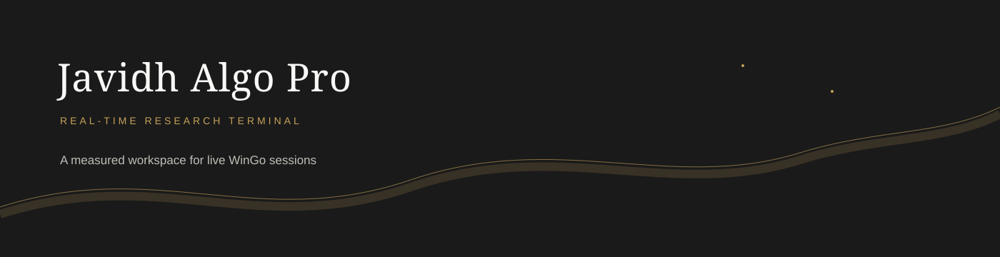

<div align="center">
  
  <h1>Javidh Algo Pro</h1>
  <p><strong>A calm, real-time WinGo research terminal for disciplined session tracking.</strong></p>
  <p>
    <a href="#run-locally">Run locally</a> ·
    <a href="#features">Features</a> ·
    <a href="#deploy">Deploy</a>
  </p>
</div>

<br />

<table>
  <tr>
    <td width="50%"><strong>Quiet luxury UI</strong><br />Ivory day mode, charcoal night mode, Playfair Display headings, and Inter controls.</td>
    <td width="50%"><strong>Live session workflow</strong><br />Period sync, one-click result recording, daily summary, risk progression, and CSV export.</td>
  </tr>
</table>

## Features

- Mobile-first responsive dashboard for 320–430px screens and desktop.
- Website-native period sync dialog with no browser prompt interruption.
- 30S / 1M mode switching with live countdown and freeze warning.
- Recency-weighted Markov analysis and recent-trend ensemble signal.
- Conservative confidence reporting when the evidence is weak.
- Today’s trades, win rate, PnL, staked amount, won-back amount, and balance.
- Reduced-motion support and subtle viewport reveal animations.
- One-click CSV export for session review.

## Run locally

```bash
python app.py
```

Open [http://localhost:5000](http://localhost:5000).

> This is a research and session-tracking tool. Historical patterns do not guarantee future outcomes. Use responsible limits and never risk money you cannot afford to lose.

## Project map

| Path | Purpose |
| --- | --- |
| `app.py` | Web server, prediction engine, API, and embedded dashboard UI |
| `assets/` | Repository presentation assets |
| `.gitignore` | Git ignore rules |

## Deploy

Push to GitHub and deploy to any Python-compatible host:

```bash
git add .
git commit -m "Initial commit"
git remote add origin https://github.com/YOUR_USERNAME/YOUR_REPO.git
git push -u origin main
```

**Deployment options:**
- **Render** — Free tier, auto-deploys from GitHub
- **Railway** — Free tier, instant deploy
- **Fly.io** — Free tier for small apps
- **Vercel** — Python serverless support
- **Heroku** — Classic PaaS option

<details>
<summary><strong>Design direction</strong></summary>
<br />

The interface is intentionally restrained: warm ivory surfaces, deep charcoal type, thin champagne-gold rules, generous whitespace, and soft content emergence as sections enter the viewport.

</details>

<div align="center">
  <sub>Built for clarity, reviewability, and deliberate decisions.</sub>
</div>
